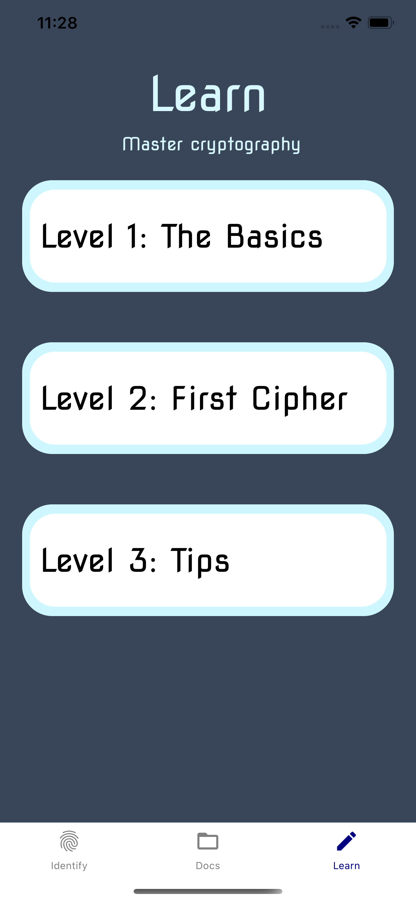

#### Cipherz was an 18 week senior class project to build an original mobile application using Expo and React Native.

# Cipherz
### Knowledge at your fingertips 

Cipherz is built to explore the world of cryptography and assist you in any cipher involved endeavors. Identify what type of code you want to decrypt, browse documentation of all recorded ciphers, and even begin free lessons to learn how to encrypt and decrypt on your own. Loaded with possible ciphers, you're sure to find whatever you're looking for. 

 
 

 

Keywords - "cipher,decode,encode,cryptography,solve,code,decipher,crypto,secret"

### Developing

* Requires Yarn and Expo
* Clone down respository and run "yarn start"
* Open in an iOS/Android simulator or scan the QR code to open in the Expo app on your personal device
